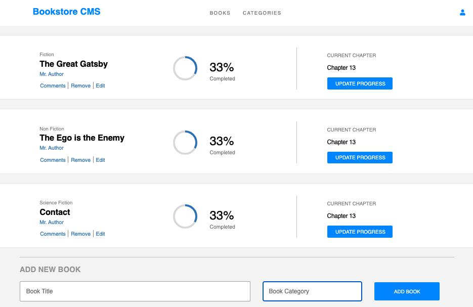

# Bookstore Web App

> A single page web application where you can store your favorite books and track their progress.



## Built With

- JavaScript
- React.js
- Redux
- API
- CSS
- Webpack

## Live Demo

Coming Soon


**To clone this project**
**Run command: ```$git clone ``` [repo](https://github.com/karelvanoordt/bookstore.git)**
**or press the green Code button in the upper right corner and choose to download from the Download ZIP link.**

## Prerequisites

- Code editor (VS Code, Sublime, Atom)

### Setup

- to create a React application is using Create React App (CRA) and following the instructions in this [guide](https://reactjs.org/docs/create-a-new-react-app.html#create-react-app)
```
npx create-react-app bookstore-react
cd bookstore-react
npm start
```
-  Add React Redux
 ```
npm install react-redux
```
- Add React Router [React Router](https://v5.reactrouter.com/web/guides/quick-start)


## Authors

👤 **Author1**

- GitHub: [@githubhandle](https://github.com/karelvanoordt)
- Twitter: [@twitterhandle](https://twitter.com/karelvanoordt)
- LinkedIn: [LinkedIn](https://linkedin.com/in/karelvanoordt)


## 🤝 Contributing

Contributions, issues, and feature requests are welcome!

Feel free to check the [issues page](https://github.com/karelvanoordt/bookstore/issues/).

## Show your support

Give a ⭐️ if you like this project!

## Acknowledgments

- Hat tip to anyone whose code was used
- Inspiration
- etc

## 📝 License

This project is [MIT](./MIT.md) licensed.